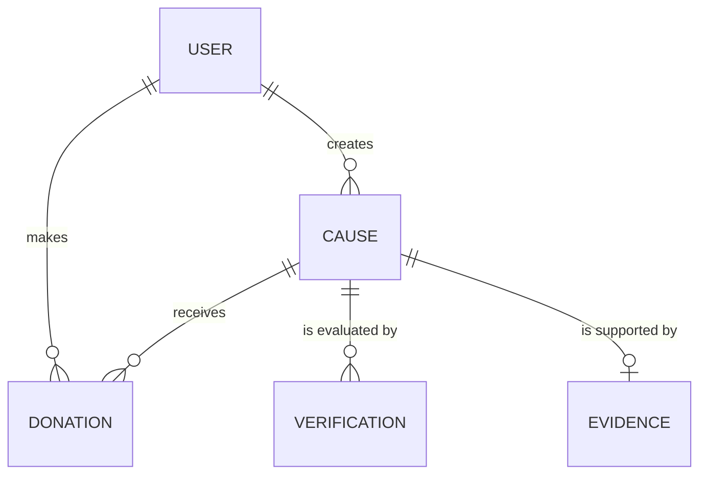

# Entity Model

## Entity Relationship Diagram

### USER

Cuenta de la plataforma, con wallet opcional. Puede donar a causas y publicar las suyas indistintamente, sin
un rol fijo por cuenta. Puede autenticarse con contraseña propia o con un proveedor externo (OAuth).

| Attribute       | Description                           | Data Type | Length/Precision | Validation Rules                                           |
|-----------------|---------------------------------------|-----------|------------------|-------------------------------------------------------------|
| id              | Unique identifier                     | Long      | 19               | Primary Key, Sequence                                       |
| username        | Nombre público del usuario            | String    | 100              | Not Null, Unique                                             |
| email           | Correo de acceso                      | String    | 255              | Not Null, Unique, Format: Email                              |
| hashed_password | Contraseña con hash bcrypt            | String    | 255              | Optional (requerido si auth_provider = local)                |
| auth_provider   | Proveedor de autenticación            | String    | 20               | Not Null, Values: local, google, Default: local              |
| external_id     | Identificador en el proveedor externo | String    | 255              | Optional, Unique (requerido si auth_provider ≠ local)        |
| wallet_address  | Dirección de wallet vinculada         | String    | 42               | Optional, Unique                                             |
| created_at      | Fecha de creación                     | DateTime  | -                | Not Null                                                     |

### CAUSE

Necesidad publicada por un receptor, verificable y con monto objetivo.

| Attribute         | Description                                   | Data Type | Length/Precision | Validation Rules                                               |
|-------------------|-----------------------------------------------|-----------|------------------|----------------------------------------------------------------|
| id                | Unique identifier                             | Long      | 19               | Primary Key, Sequence                                          |
| recipient_id      | Receptor que crea la causa                    | Long      | 19               | Not Null, Foreign Key (USER.id)                                |
| onchain_cause_id  | Identificador de la causa en CauseVault       | Long      | 19               | Optional, Unique                                               |
| title             | Título de la causa                            | String    | 255              | Not Null                                                       |
| description       | Descripción de la necesidad                   | String    | 2000             | Not Null                                                       |
| image_hash        | Hash IPFS de la foto de evidencia             | String    | 100              | Optional                                                       |
| target_amount     | Monto objetivo en USDT                        | Decimal   | 18,6             | Not Null, Min: 0.000001                                        |
| status            | Estado de la causa                            | String    | 20               | Not Null, Values: Pending, Verified, Rejected, Completed       |
| verification_hash | Hash IPFS del análisis de IA                  | String    | 100              | Optional                                                       |
| created_at        | Fecha de creación                             | DateTime  | -                | Not Null                                                       |

### DONATION

Donación registrada on-chain por un donante a una causa; el backend guarda un espejo para consulta.

| Attribute  | Description                          | Data Type | Length/Precision | Validation Rules                  |
|------------|--------------------------------------|-----------|------------------|-----------------------------------|
| id         | Unique identifier                    | Long      | 19               | Primary Key, Sequence             |
| cause_id   | Causa que recibe la donación         | Long      | 19               | Not Null, Foreign Key (CAUSE.id)  |
| donor_id   | Donante que aporta                   | Long      | 19               | Not Null, Foreign Key (USER.id)   |
| amount     | Monto donado en USDT                 | Decimal   | 18,6             | Not Null, Min: 0.000001           |
| tx_hash    | Hash de la transacción on-chain      | String    | 66               | Not Null, Unique                  |
| created_at | Fecha de la donación                 | DateTime  | -                | Not Null                          |

### VERIFICATION

Resultado de cada evaluación del agente de IA sobre una causa.

| Attribute  | Description                                  | Data Type | Length/Precision | Validation Rules                  |
|------------|----------------------------------------------|-----------|------------------|-----------------------------------|
| id         | Unique identifier                            | Long      | 19               | Primary Key, Sequence             |
| cause_id   | Causa evaluada                               | Long      | 19               | Not Null, Foreign Key (CAUSE.id)  |
| verified   | Resultado de la evaluación                   | Boolean   | 1                | Not Null                          |
| confidence | Nivel de confianza del modelo                | Decimal   | 3,2              | Not Null, Min: 0, Max: 1          |
| reason     | Explicación breve del modelo                 | String    | 500              | Not Null                          |
| tx_hash    | Hash de la tx `verifyCause` en HSK           | String    | 66               | Optional, Unique                  |
| created_at | Fecha de la evaluación                       | DateTime  | -                | Not Null                          |

### EVIDENCE

Imagen de evidencia subida por el receptor y evaluada por el agente (UC-005, FR-021). Una por causa; se reemplaza mientras la causa está Pending.

| Attribute    | Description                              | Data Type | Length/Precision | Validation Rules                        |
|--------------|------------------------------------------|-----------|------------------|-----------------------------------------|
| id           | Unique identifier                        | Long      | 19               | Primary Key, Sequence                   |
| cause_id     | Causa a la que pertenece                 | Long      | 19               | Not Null, Unique, Foreign Key (CAUSE.id) |
| content_type | Tipo de la imagen                        | String    | 20               | Not Null, Values: image/jpeg, image/png |
| sha256       | Huella SHA-256 del contenido             | String    | 64               | Not Null                                |
| data         | Contenido binario de la imagen           | Binary    | máx 5 MB         | Not Null                                |
| created_at   | Fecha de carga                           | DateTime  | -                | Not Null                                |

## Implementation Notes (auditoría 2026-09-20)

Diferencias entre este modelo y `backend/app/db/models/base.py`. El modelo lógico manda; estas filas son deuda de implementación.

| Entidad      | Atributo / regla                     | Modelo lógico                                   | Código actual                                                                 | Acción                                                                 |
|--------------|--------------------------------------|-------------------------------------------------|--------------------------------------------------------------------------------|------------------------------------------------------------------------|
| USER         | auth_provider, external_id           | Presentes (OAuth Google, UC-001 A3)             | Ausentes                                                                       | Deferred con UC-001 A3                                                 |
| USER         | hashed_password                      | Optional (solo local)                           | Not Null                                                                       | Ajustar al implementar OAuth                                           |
| USER         | hashed_password (algoritmo)          | bcrypt                                          | argon2id (NFR-006 actualizado)                                                 | Modelo actualizado: hash adaptativo                                    |
| CAUSE        | onchain_cause_id                     | Enlaza con CauseVault                           | Asignado por `POST /causes/{id}/publish/confirm` leyendo el evento `CauseCreated` | Resuelto (UC-013)                                                   |
| CAUSE        | image_hash                           | Hash IPFS de la foto                            | SHA-256 completo (64 hex) de la imagen guardada en EVIDENCE                     | Resuelto (FR-021); no es un CID IPFS                                   |
| CAUSE        | status                               | Pending, Verified, Rejected, Completed          | El agente fija Verified/Rejected tras confirmar el veredicto on-chain; Completed aún no se sincroniza | Verified/Rejected resueltos (UC-006 BR-005); Completed con UC-014 |
| CAUSE        | verification_hash                    | Hash IPFS del análisis                          | SHA-256 completo del veredicto JSON canónico, persistido y registrado on-chain  | Resuelto; huella SHA-256, no CID IPFS                                  |
| VERIFICATION | cause_id                             | Una fila por evaluación (relación 1:N)          | `unique=True` (1:1); una reevaluación actualiza la fila (upsert)                | Decidido: 1:1 con upsert                                               |
| DONATION     | (toda la entidad)                    | Espejo de donaciones on-chain                   | Tabla existe; ningún endpoint escribe filas                                    | UC-014 / FR-020                                                        |
| Contrato     | Cause, Donation on-chain             | Fuente de verdad de donaciones y verificación   | `CauseVault`: `Cause{verified,collected,...}`, `Donation`, eventos             | Documentado en UC-009/010, NFR-011                                     |

